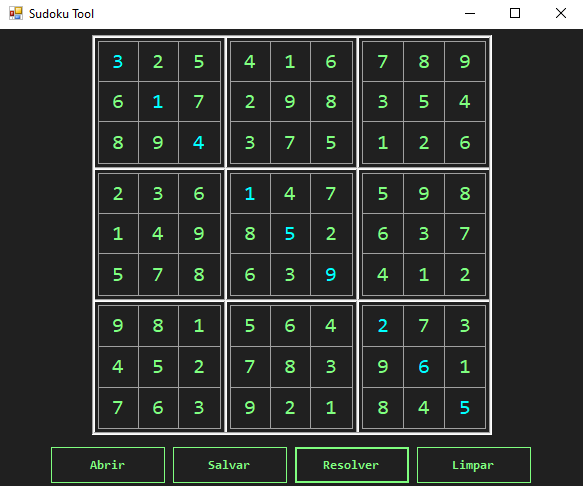
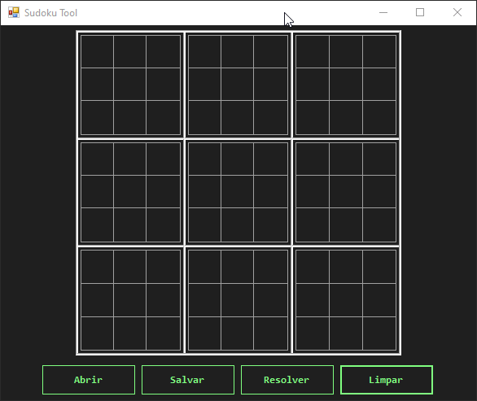

# Sudoku-Tool

## Descrição
O Sudoku-Tool é uma ferramenta desenvolvida para resolver puzzles de Sudoku utilizando o algoritmo de backtracking. Esta aplicação é escrita em C# e utiliza o .NET Framework.

<p align="center">
  
</p>

## Aplicações
- Criar configurações de Sudoku.
- Estudar a implementação de interfaces em C# com Windows Forms.

<p align="center">
  
</p>

## Pré-requisitos
- Visual Studio 2019 ou superior
- .NET Framework 4.7.2 ou superior

## Instalação e Configuração
1. **Clone o Repositório**
    ```sh
    git clone https://github.com/JunioCesarFerreira/Sudoku-Tool.git
    ```
2. **Abra o Projeto no Visual Studio**
    - Inicie o Visual Studio.
    - Selecione `Open a project or solution`.
    - Navegue até o diretório onde você clonou o repositório e selecione `SudokuBacktracking.sln`.

3. **Restaurar Pacotes NuGet**
    - No Visual Studio, vá até `Tools` > `NuGet Package Manager` > `Manage NuGet Packages for Solution...`.
    - Certifique-se de que todos os pacotes necessários estão instalados. Clique em `Restore` se necessário.

4. **Compilar o Projeto**
    - No menu superior, selecione `Build` > `Build Solution` (ou `Ctrl+Shift+B`).

## Como Usar
1. **Executar o Projeto**
    - Após a compilação, pressione `F5` ou clique em `Start` para executar o projeto.

2. **Resolver um Sudoku**
    - Na interface da aplicação, insira os números do Sudoku que você deseja resolver.
    - Clique no botão `Resolver` para que o algoritmo de backtracking resolva o puzzle.

3. **Visualizar o Resultado**
    - A solução do Sudoku será exibida na interface da aplicação.

4. **Abrir e Salvar**
    - Utilize os botões `Abrir` e `Salvar` para abrir jogos salvos ou para salvar seus jogos.

## Executável
O executável do programa está disponível no [diretório](./SudokuBacktracking/SudokuBacktracking/bin/Debug/).

## Licença
Este projeto está licenciado sob os termos da [licença MIT](./LICENSE).
